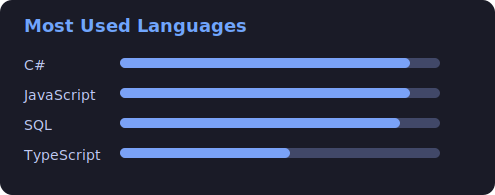

<div align="center">

<!-- ===================== 🔥 CUSTOM ANIMATED NAME LOGO ===================== -->

<svg width="900" height="120" viewBox="0 0 900 120" xmlns="http://www.w3.org/2000/svg">
  <defs>
    <linearGradient id="grad1" x1="0%" y1="0%" x2="100%" y2="0%">
      <stop offset="0%" stop-color="#00F5FF" />
      <stop offset="50%" stop-color="#FF00FF" />
      <stop offset="100%" stop-color="#00F5FF" />
    </linearGradient>
    <filter id="glow">
      <feGaussianBlur stdDeviation="5" result="coloredBlur"/>
      <feMerge>
        <feMergeNode in="coloredBlur"/>
        <feMergeNode in="SourceGraphic"/>
      </feMerge>
    </filter>
  </defs>
  <text x="50%" y="60%" text-anchor="middle" font-size="60"
        font-family="Orbitron, Arial, Helvetica, sans-serif"
        fill="url(#grad1)" filter="url(#glow)">
    VIKRANT YADAV
    <animate attributeName="opacity" values="0.7;1;0.7" dur="2.5s" repeatCount="indefinite"/>
  </text>
</svg>


</div>

---

# 🧊 EXECUTIVE SNAPSHOT

```yaml
Name: Vikrant Yadav
Role: Full Stack .NET Engineer
Stack: ASP.NET Core | C# | React.js | SQL Server | PostgreSQL
Architecture: Clean Architecture | REST APIs | Microservices
Cloud: Azure | AWS | Docker
Focus: Performance, Scalability, Maintainability
```

✔ Production-ready backend systems  
✔ Secure authentication & authorization  
✔ Optimized database design  
✔ Responsive frontend UI  
✔ Cloud-ready deployment mindset  

---

# 🚧 CURRENTLY BUILDING

- MedicalScore → Scalable healthcare management platform  
- .NET 10 APIs using Clean Architecture & Dapper  
- Real-time systems with SignalR & WebSockets  
- Secure auth flows (JWT, RBAC, refresh tokens)

---

# 🟣 TECH MATRIX
 
<picture>
  
  
</picture>
 
<div align="center">

</div>

---

# 🧠 SYSTEM DESIGN DNA

```csharp
public sealed class VikrantYadav
{
    public string Title => "Full Stack .NET Engineer";

    public string[] Expertise => new[]
    {
        "ASP.NET Core",
        "Dapper / EF Core",
        "REST APIs",
        "React.js",
        "SQL Optimization",
        "Microservices",
        "Cloud Deployment"
    };

    public string Philosophy() =>
        "First make it work. Then make it clean. Then make it scalable.";
}
```

 

# 🏆 ELITE BADGE WALL

<div align="center">


<br/><br/>


</div>

 
# 🎧 Music While Coding
<div align="center">
<a href="https://open.spotify.com/user/31rw3ireka6kl6ksb5epaqi2ipti">
  
</a>
</div>

<p align="center">🎧 Writing clean code with good music.</p>


---

# 📊 GITHUB ANALYTICS

<div align="center">
   
<!--


 

 
 -->
 
 


<br/>


</div>

---

# 🐍 CONTRIBUTION SNAKE

<div align="center">
<picture>
  <source media="(prefers-color-scheme: dark)"
          srcset="https://raw.githubusercontent.com/vikrant-eng/vikrant-eng/output/github-contribution-grid-snake-dark.svg">
  
</picture>
</div>

---

# 📈 ACTIVITY GRAPH

<div align="center">

</div>

---

# 💎 MINIMAL FOUNDER MODE

<div align="center">

## Vikrant Yadav  
### Full Stack Engineer | System Architect  

Building scalable digital infrastructure with precision.

</div>

---

# 🌍 CONNECT WITH ME

<div align="center">

<a href="https://www.linkedin.com/in/vikrant-y-69b477242">

</a>

<a href="mailto:dev.vikrant21@gmail.com">

</a>

</div>

---

<div align="center">

> **“Design systems that scale. Write code that lasts.”**


</div>
